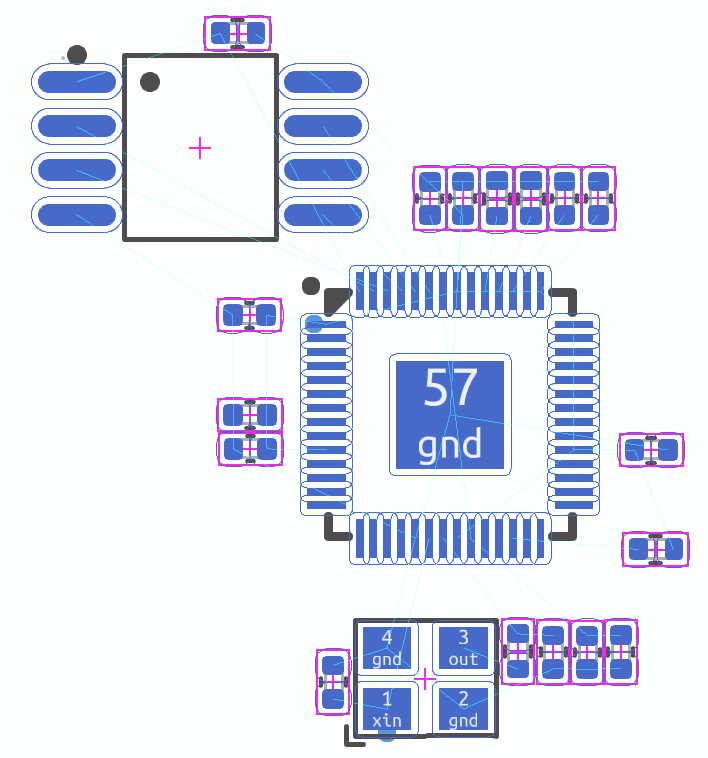

# RP2040 Module

## Overview

This document provides an overview and basic usage instructions for the RP2040 module. The RP2040 is a versatile microcontroller module featuring a range of interfaces and a robust design, suitable for a variety of applications.

## Installation
Run in the terminal:
ato install rp2040

Add to your ato project:
import RP2040Kit from "rp2040/rp2040.ato"

## Features

- **Power Interface:** Standard power interface compatible with common voltage sources.
- **SPI Interface:** High-speed Serial Peripheral Interface for fast data transfer.
- **I2C Interface:** Inter-Integrated Circuit interface for connecting low-speed peripherals.
- **USB 2.0 Interface:** Universal Serial Bus interface for computer connectivity and data transfer.
- **GPIO Pins:** 27 General Purpose Input/Output pins (GPIO 0-26) for versatile digital input/output functionality.
- **Analog Inputs:** Four analog inputs (A0-A3) for reading analog signals.

## Additional Components

- **12 MHz Crystal:** Provides a stable clock source for timing-sensitive applications.
- **QSPI Memory:** Quick Serial Peripheral Interface memory for efficient data storage and access.

## Getting Started

1. **Powering the Module:** Requires a 3.3V supply connected to the power interface.
2. **Connecting Interfaces:** Utilize SPI, I2C, and USB interfaces as per your project requirements.
3. **Utilizing GPIO and Analog Inputs:** Connect your sensors or peripherals to the GPIO or analog inputs as needed.
4. **Programming:** Program the module using your preferred development environment compatible with the RP2040.

## Example Layout

### Layout notes
- Caps should be close to micro for 3V3 an 1V1 rails
- 12MHz crystal should be close to micro
- USB series resistors should be close to micro
- Maybe just put everything close to the micro...

## Documentation & Resources

- [Official RP2040 Datasheet](#)
- [Interface Usage Guidelines](#)
- [GPIO Programming Examples](#)
- [Community Forums and Support](#)

## Contributing

We welcome contributions and suggestions to improve this module. Please submit your contributions as pull requests on our GitHub repository.

## License

This RP2040 module documentation is provided under the [MIT License](#).

## Contact

For further inquiries or support, please contact us at [email@example.com](mailto:email@example.com).
